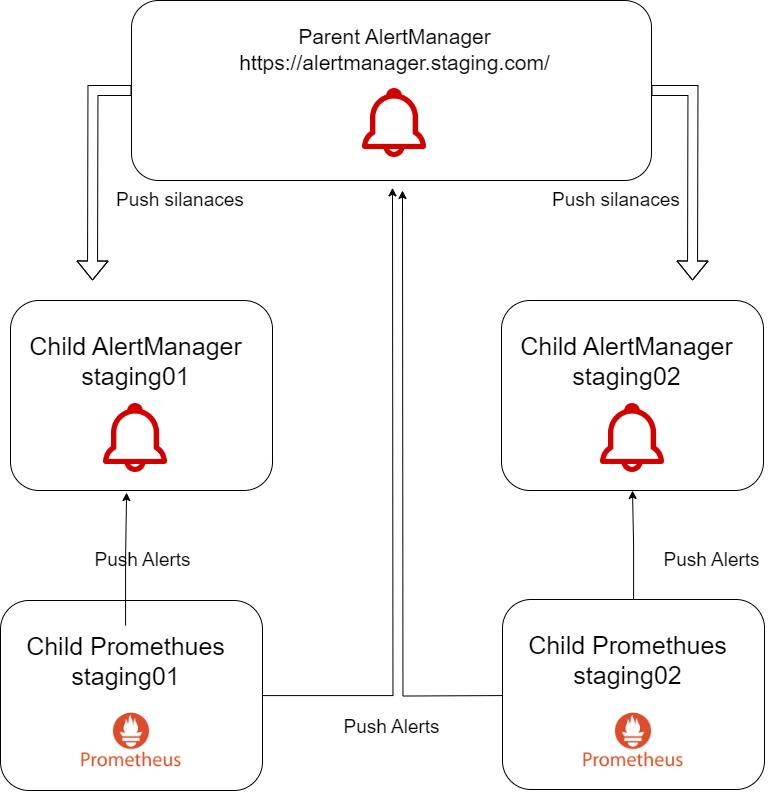

# alert-manager-ctl
This tool is to manage alertManager federation

## Architecure diagram



## Build


```sh
go mod init alertmanager-federation
go install .
go build .
```


## Usage

### Setup prometheus alerts
- If you are using kube-prometheus-stack helm chart, you can push alerts to external alertManager
```
additionalAlertManagerConfigs:
  - scheme: http
    static_configs:
    - targets:
      - "alertmanager.staging.com:80"
```

### Setup alertManager federation
```
helm install --name=alertmanager-federation --namespace=default
```
